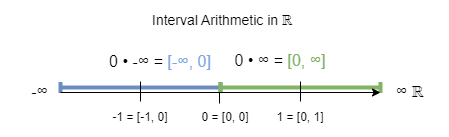

# Solving indeterminate forms using interval arithmetic

*by Norbert Nopper*

#### Credits

Thanks to Eric Lengyel for asking the initial right questions.

Thanks a lot to my family and their patience having me as a 🤓.

### Thesis

$$0 \star ∞ = -1 \star (0 \star -∞)$$

#### Status quo

The expressions $0 \star ∞$ and implicitly $0 \star -∞$ are indeterminate forms [1].

A naive approach like $-1 \star (0 \star -∞)$ <=> $(-1 \star 0) \star -∞)$ with math limits [2] results again in $0 \star -∞$ even when the associative law is allowed.

Existing required math limits for above assumption:

$\lim_{n\to\infty}\sqrt[n]{n}=1$  
$\lim_{n\to\infty}\frac{1}{n}=0$  
$\lim_{n\to\infty}{n}=\infty$

Assume the usage of the associative law is allowed:

$\lim_{n\to\infty}-\sqrt[n]{n} \times \lim_{n\to\infty}\frac{1}{n} = \lim_{n\to\infty}-\sqrt[n]{n} \times \frac{1}{n} = \lim_{n\to\infty}\frac{-1}{n}$

The result is again 0.

### Idea

In interval arithmetic, the intervals $[0, ∞]$ and $[-∞, 0]$ are allowed [3].

The indeterminate form of $0 \star ∞$ can be expressed as the interval $[0, ∞]$.  
Similar, the indeterminate form of $0 \star -∞$ is $[-∞, 0]$.

The interval $[x_0, x_1]$ is estimated from $a * b \in \mathbb R \land a \le b$ providing following rule:

$$[x_0, x_1] = \{ x_0 = a * b \, | \, b \in [a, b[ \, \land \, x_1 = a * b  \, | \, a \in ]a, b] \}$$

### Interval arithmetic operators

*ToDo:*  
*Define Addition and Multiplication for minimal algebraic structure Ring [4]*

### Deduction

$
-1 \star (0 \star -∞) \\
-1 \star [-∞, 0] \\
[-1 \star -∞, -1 \star 0] \\
[0, ∞] \\
0 \star ∞
$

*ToDo:*  
*For each step, name the rules and operators.*

### Implementation

In the [test](test/) folter is an implementation of this interval arithmetic.   

*ToDo:*  
*Depending on the mathematical Ring, extend implementation and unit tests.*

### Conclusion

Using this approach, other indeterminate forms could be expressed as interval arithmetics and solved to equations as well.

*ToDo:*  
*Add investigation, if the algebraic structure is more than a mathematical Ring.*

### References

[1] [Indeterminate form](https://en.wikipedia.org/wiki/Indeterminate_form)  
[2] [Limit (mathematics)](https://en.wikipedia.org/wiki/Limit_(mathematics))  
[3] [Interval arithmetic](https://en.wikipedia.org/wiki/Interval_arithmetic)  
[4] [Ring (mathematics)](https://en.wikipedia.org/wiki/Ring_(mathematics))
