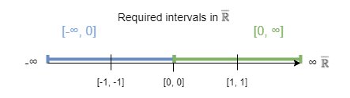

# Solution for indeterminate forms using interval numbers

*by Norbert Nopper*

## Credits

Thanks to Eric Lengyel for asking the initial right questions.

Thanks a lot, to my family and their patience having me as a 🤓.

## Note

The math formulas are encoded using [MathJax](https://www.mathjax.org/). However, the decoding and rendering is not properly done in GitHub.  
For properly displaying the formulas, please use another editor like [Visual Studio Code](https://code.visualstudio.com/).

## Motivation

The expressions $0 \cdot ∞$ and implicitly $0 \cdot -∞$ are indeterminate forms [[1](#1-indeterminate-form)]. It is not possible to do any calculus on these expressions like $-1 \cdot (0 \cdot -∞)$.  
However, compared to $x = -1 \cdot -x$, intuitively the following equation should be true: 

$$0 \cdot ∞ = -1 \cdot (0 \cdot -∞)$$

### Problem

A naive approach like $-1 \cdot (0 \cdot -∞) = (-1 \cdot 0) \cdot -∞$ with math limits results again in $0 \cdot -∞$ even when the associative law is allowed.

#### Investigation

Existing required math limits for above assumption:

$\lim_{n\to\infty}\sqrt[n]{n}=1$  
$\lim_{n\to\infty}\frac{1}{n}=0$  

Assume the usage of the associative law is allowed:

$\lim_{n\to\infty}-\sqrt[n]{n} \cdot \lim_{n\to\infty}\frac{1}{n} = \lim_{n\to\infty}-\sqrt[n]{n} \cdot \frac{1}{n} = \lim_{n\to\infty}\frac{-1}{n}$

The result is again 0 and does not provide the expected result.

## New interval number

### Assumption

In the case of the given two indeterminate forms, the result could be **any** number. However, the resulting number can be enclosed in an interval.  

#### Using extended real number  

Using the extended real number system $\overline {\mathbb R}$ [[2](#2-extended-real-number-line)], the intervals $[0, ∞]$ and $[-∞, 0]$ are allowed.

#### Enclosing the result in an interval

Following is given:

$a, b \in \overline {\mathbb R} \land a \le b$

Interval, where the result for $a \cdot b$ is enclosed in the interval: 

$[x_0, x_1] = \{ x_0 = a \cdot \beta | \beta \in [a, b[ \land x_1 = \alpha \cdot b | \alpha \in ]a, b] \}$

### Definition

As the result is probably not **all** numbers in the interval, **any** or at least **one** number in the interval must be expressed as a new interval number *in*:

$[x_0, x_1]in := \{ x \in \overline {\mathbb R} | \exists x \in [x_0, x_1] \}$

The indeterminate form of $0 \cdot ∞$ can be expressed as the first rule:

***Rule I***  
$0 \cdot ∞ = [0, ∞]in$

Similar, the expression for the indeterminate form of $0 \cdot -∞$ is the second rule:

***Rule II***  
$0 \cdot -∞ = [-∞, 0]in$

### Interval number operation

These is the given mathematical operation.

#### Multiplication

$[x_0, x_1]in \cdot [y_0, y_1]in := [\min(x_0 \cdot y_0, x_0 \cdot y_1, x_1 \cdot y_0, x_1 \cdot y_1), \max(x_0 \cdot y_0, x_0 \cdot y_1, x_1 \cdot y_0, x_1 \cdot y_1)]in$

Regarding the algebraic structure [[3](#3-algebraic-structure)], only the required multiplication for the given rules is investigated.

This algebraic structure of the interval numbers is at least a Magma [[4](#4-magma-algebra)], as all multiplications in $\overline {\mathbb R}$ including ***Rule I*** and ***Rule II*** are defined.

### Deduction

|                               | Operation or rule                    |
|-------------------------------|--------------------------------------|
| $-1 \cdot (0 \cdot -∞)$       | ***Rule II***                        |
| $-1 \cdot [-∞, 0]in$          | Multiplication for interval number   |
| $[-1 \cdot -∞, -1 \cdot 0]in$ | Operation in $\overline {\mathbb R}$ |
| $[0, ∞]in$                    | ***Rule I***                         |
| $0 \cdot ∞$                   |                                      |

## Implementation

In the [test](test/) folder is a C++ implementation of the interval number and the unit tests.

## Some indeterminate forms as interval numbers

At point of writing, the expression $\frac{0}{0}$ is undefined, also in $\overline {\mathbb R}$ [[5](#5-affinely-extended-real-numbers)].  
However, with interval numbers, the expression can be defined:

$\frac{0}{0} = [-∞, ∞]in$

Because the limits of the given example formula results in +∞ and -∞:

$\lim_{n\to0^+}\frac{n}{n^2} = +∞$

$\lim_{n\to0^-}\frac{n}{n^2} = -∞$

---

Similarly, the indeterminate form $∞ - ∞$ can be expressed as:

$∞ - ∞ = [-∞, ∞]in$

Because different limit approaches yield different results:

$\lim_{n\to∞}(n - n) = 0$

$\lim_{n\to∞}(n^2 - n) = ∞$

$\lim_{n\to∞}(n - n^2) = -∞$

---

The indeterminate form $\frac{∞}{∞}$ can be expressed as:

$\frac{∞}{∞} = [0, ∞]in$

Because different limit approaches yield different results:

$\lim_{n\to∞}\frac{n}{n} = 1$

$\lim_{n\to∞}\frac{n}{n^2} = 0$

$\lim_{n\to∞}\frac{n^2}{n} = ∞$

---

The indeterminate form $0^0$ can be expressed as:

$0^0 = [0, 1]in$

Because different limit approaches yield different results:

$\lim_{x\to0^+}x^x = 1$

$\lim_{x\to0^+}0^x = 0$

$\lim_{x\to0^+}x^0 = 1$

---

The indeterminate form $1^∞$ can be expressed as:

$1^∞ = [0, ∞]in$

Because different limit approaches yield different results:

$\lim_{n\to∞}1^n = 1$

$\lim_{n\to∞}(1 + \frac{1}{n})^n = e$

$\lim_{n\to∞}(1 + \frac{1}{n})^{n^2} = ∞$

$\lim_{n\to∞}(1 - \frac{1}{n})^n = \frac{1}{e}$

---

The indeterminate form $∞^0$ can be expressed as:

$∞^0 = [1, ∞]in$

Because different limit approaches yield different results:

$\lim_{n\to∞}n^0 = 1$

$\lim_{n\to∞}n^{\frac{1}{n}} = 1$

$\lim_{n\to∞}n^{\frac{1}{\sqrt{n}}} = ∞$

## Some equations from indeterminate forms resulting back in a non-indeterminate form

$(0^0) \cdot 0 = 0$

Because:

$0^0 = [0, 1]in$

$[0, 1]in \cdot 0 = [\min(0 \cdot 0, 1 \cdot 0), \max(0 \cdot 0, 1 \cdot 0)] = [0, 0]in = 0$

---

$|\frac{0}{0}| + ∞ = ∞$

Because:

$\frac{0}{0} = [-∞, ∞]in$

$|-∞, ∞|in = [0, ∞]in$

$[0, ∞]in + ∞ = [0 + ∞, ∞ + ∞] = [∞, ∞]in = ∞$

---

## Conclusion

Using this approach, other indeterminate forms could be expressed as an interval and solved to equations as well. Especially the usage and current definition in measure theory should be further evaluated [[6](#6-extended-real-numbers)].

For now, it is shown, that the algebraic structure of the interval number is a Magma. However, including the other mathematical operations, the algebraic structure could be further investigated.

Furthermore, other intervals for indeterminate forms could be estimated and defined.

## References

##### 1 Indeterminate form
https://en.wikipedia.org/wiki/Indeterminate_form

##### 2 Extended real number line
https://en.wikipedia.org/wiki/Extended_real_number_line

##### 3 Algebraic structure
https://en.wikipedia.org/wiki/Algebraic_structure

##### 4 Magma (algebra)
https://en.wikipedia.org/wiki/Magma_(algebra)

##### 5 Affinely Extended Real Numbers
https://mathworld.wolfram.com/AffinelyExtendedRealNumbers.html

##### 6 extended real numbers
https://planetmath.org/extendedrealnumbers
