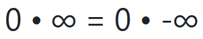

# Solving indeterminate forms using interval arithmetic



## Status quo

The expressions `0 • ∞` and implicitly `0 • -∞` are indeterminate forms [1].

## New equation

The above expressions can be solved to the equation `0 • ∞ = 0 • -∞`.

## Deduction

In interval arithmetic, the intervals `[0, ∞]` and `[-∞, 0]` are allowed [2].

The indeterminate form of `0 • ∞` can be expressed as the interval `[0, ∞]`.  
Similar, the indeterminate form of `0 • -∞` is `[-∞, 0]`.

### Idea

The idea is to calculate the two interval bounds for not indeterminate forms.

I.  
`0 • ∞ = [0, ∞]`:

Replacing second multiplier with 0:  
`0 • 0 = 0`  
Replacing first multiplier with 1:  
`1 • ∞ = ∞`

II.  
`0 • -∞ = [-∞, 0]`:

Replacing second multiplier with 0:  
`0 • 0 = 0`  
Replacing first multiplier with 1:  
`1 • -∞ = -∞`

## Proof

```
0 • -∞      | see II.
[-∞, 0]     | Exclude -1
-1 • [0, ∞] | see I.
-1 • 0 • ∞  | -1 • 0 is 0
0 • ∞

q.e.d.
```

## Conclusion

Using this approach, other indeterminate forms could be expressed as intervals and solved to equations as well.

## References

[1] [Indeterminate form](https://en.wikipedia.org/wiki/Indeterminate_form)  
[2] [Interval arithmetic](https://en.wikipedia.org/wiki/Interval_arithmetic)
