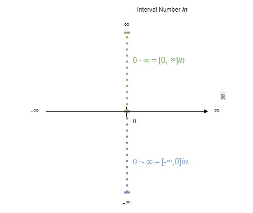

# Solving indeterminate forms using interval arithmetic

*by Norbert Nopper*

#### Credits

Thanks to Eric Lengyel for asking the initial right questions.  

### Status quo

The expressions $0 \times ∞$ and implicitly $0 \times -∞$ are indeterminate forms [1].

*ToDo:*  
*Explain problem, that no calculations can be done.*  

### Thesis

$0 \times ∞ = -1 \times (0 \times -∞)$

### Inspiration

*ToDo:*  
*Explain shortly for complex numbers [2]*  
  

In interval arithmetic, the intervals `[0, ∞]` and `[-∞, 0]` are allowed [3].

The indeterminate form of `0 x ∞` can be expressed as the interval `[0, ∞]`.  
Similar, the indeterminate form of `0 x -∞` is `[-∞, 0]`.

The idea is to calculate the two interval bounds for not indeterminate forms.

I.  
`0 x ∞ = [0, ∞]`:

Replacing second multiplier with 0:  
`0 x 0 = 0`  
Replacing first multiplier with 1:  
`1 x ∞ = ∞`

II.  
`0 x -∞ = [-∞, 0]`:

Replacing second multiplier with 0:  
`0 x 0 = 0`  
Replacing first multiplier with 1:  
`1 x -∞ = -∞`

*ToDo:*  
*New illustraion*  
  

### Deduction

*ToDo:*  
*Explain `-1 x (0 x -∞)` => `0 x ∞`.* 

```
// Given interval [x1, x2] using interval arithmetic
//
// a + b*in
//
// where a = x1
// where b = x2 - x1
// where in is the new integral number (similar as i in complex numbers)
//
// a + b*in = (a + b) - b*in
```

### Interval arithmetic operators

*ToDo:*  
*Define Addition and Multiplication for minimal algebraic structure of Ring [4]*  

### Implementation

*ToDo:*  
*Adapt source code.*  

### Conclusion

Using this approach, other indeterminate forms could be expressed as interval arithmetics and solved to equations as well.

### References

[1] [Complex number](https://en.wikipedia.org/wiki/Complex_number)  
[2] [Indeterminate form](https://en.wikipedia.org/wiki/Indeterminate_form)  
[3] [Interval arithmetic](https://en.wikipedia.org/wiki/Interval_arithmetic)  
[4] [Ring (mathematics)](https://en.wikipedia.org/wiki/Ring_(mathematics))  

#

*ToDo:*  
*Quick links and to be integrated and/or removed later.*

### Form

Markdown Cheat Sheet  
https://www.markdownguide.org/cheat-sheet/

Writing mathematical expressions  
https://docs.github.com/en/get-started/writing-on-github/working-with-advanced-formatting/writing-mathematical-expressions

### Inhalt

Teilgebiete der Mathematik  
https://de.wikipedia.org/wiki/Teilgebiete_der_Mathematik

**Algebra**

Algebraische Struktur  
https://de.wikipedia.org/wiki/Algebraische_Struktur

- Kommutativgesetz  
https://de.wikipedia.org/wiki/Kommutativgesetz

- Distributivgesetz  
https://de.wikipedia.org/wiki/Distributivgesetz

- Assoziativgesetz  
https://de.wikipedia.org/wiki/Assoziativgesetz

- Inverses Element  
https://de.wikipedia.org/wiki/Inverses_Element

Körper (Algebra)  
https://de.wikipedia.org/wiki/K%C3%B6rper_(Algebra)

Ring (mathematics)  
https://en.wikipedia.org/wiki/Ring_(mathematics)  

*Zahlen*

Hyperreelle Zahl  
https://de.wikipedia.org/wiki/Hyperreelle_Zahl

Unendlich (Mathematik)  
https://de.wikipedia.org/wiki/Unendlich_(Mathematik)

**Analysis**

improper limits  
https://planetmath.org/improperlimits

Grenzwert (Funktion)  
https://de.wikipedia.org/wiki/Grenzwert_(Funktion)

### Übersetzungen

Unbestimmter Ausdruck (Mathematik) (zu [1])  
https://de.wikipedia.org/wiki/Unbestimmter_Ausdruck_(Mathematik)

Intervallarithmetik (zu [2])  
https://de.wikipedia.org/wiki/Intervallarithmetik
