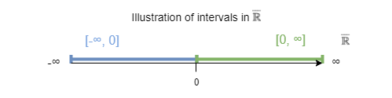

# Solution for indeterminate forms using interval numbers

*by Norbert Nopper*

## Credits

Thanks to Eric Lengyel for asking the initial right questions.

Thanks a lot to my family and their patience having me as a 🤓.

## Motivation

The expressions $0 \cdot ∞$ and implicitly $0 \cdot -∞$ are indeterminate forms [1]. It is not possible to do any calculus on these expressions like $-1 \cdot (0 \cdot -∞)$. Intuitively the following equation should be true: 

$$0 \cdot ∞ = -1 \cdot (0 \cdot -∞)$$

### Problem

A naive approach like $-1 \cdot (0 \cdot -∞) = (-1 \cdot 0) \cdot -∞$ with math limits results again in $0 \cdot -∞$ even when the associative law is allowed.

#### Investigation

Existing required math limits for above assumption:

$\lim_{n\to\infty}\sqrt[n]{n}=1$  
$\lim_{n\to\infty}\frac{1}{n}=0$  

Assume the usage of the associative law is allowed:

$\lim_{n\to\infty}-\sqrt[n]{n} \cdot \lim_{n\to\infty}\frac{1}{n} = \lim_{n\to\infty}-\sqrt[n]{n} \cdot \frac{1}{n} = \lim_{n\to\infty}\frac{-1}{n}$

The result is again 0.

## New interval number

### Assumption

In the case of the two indeterminate forms, the result could be **any** number. However, the resulting number can be enclosed in an interval.  

#### Using extended real number  

Using the extended real number system $\overline {\mathbb R}$ [2], the intervals $[0, ∞]$ and $[-∞, 0]$ are allowed.

#### Enclosing the result in an interval

Following is given:

$a, b \in \overline {\mathbb R} \land a \le b$

Interval, where the result is enclosed: 

$[x_0, x_1] = \{ x_0 = a \cdot b | b \in [a, b[ \land x_1 = a \cdot b | a \in ]a, b] \}$

### Definition

As the result is not **all** numbers in the interval, **any** numbers in the interval has to be expressed as a new interval number *in*:

$[x_0, x_1]in := \{ x \in \overline {\mathbb R} | \exists x \in [x_0, x_1] \}$

The indeterminate form of $0 \cdot ∞$ can be expressed as:

$0 \cdot ∞ = [0, ∞]in$

Similar, the indeterminate form of $0 \cdot -∞$ is:

$0 \cdot -∞ = [-∞, 0]in$

### Interval number operations

*ToDo:*  
*Are interval addition and multiplication of interval trivial?*  
*https://www.lernhelfer.de/schuelerlexikon/mathematik/artikel/intervalle-rechnen.*  

*ToDo:*  
*Define and proof Addition and Multiplication for minimal algebraic structure Ring [3] requirements.*

### Deduction

$-1 \cdot (0 \cdot -∞)$  
$-1 \cdot [-∞, 0]in$  
$[-1 \cdot -∞, -1 \cdot 0]in$  
$[0, ∞]in$  
$0 \cdot ∞$

*ToDo:*  
*For each step, name the rules and operations.*

### Implementation

In the [test](test/) folder is an implementation of the interval number and the unit tests.   

*ToDo:*  
*Depending on the mathematical Ring, extend implementation and unit tests.*

### Conclusion

Using this approach, other indeterminate forms could be expressed as an interval and solved to equations as well.

*ToDo:*  
*Estimate intervals for indeterminate forms with exponents e.g.*  
$1^∞ = [1, ∞]in$  
$∞^0 = [1, ∞]in$  
*results in this equation:*  
$1^∞ = ∞^0$

*ToDo:*  
*Add investigation, if the algebraic structure is more than a mathematical Ring.*

### References

[1] [Indeterminate form](https://en.wikipedia.org/wiki/Indeterminate_form)  
[2] [Extended real number line](https://en.wikipedia.org/wiki/Extended_real_number_line)  
[3] [Ring (mathematics)](https://en.wikipedia.org/wiki/Ring_(mathematics))
