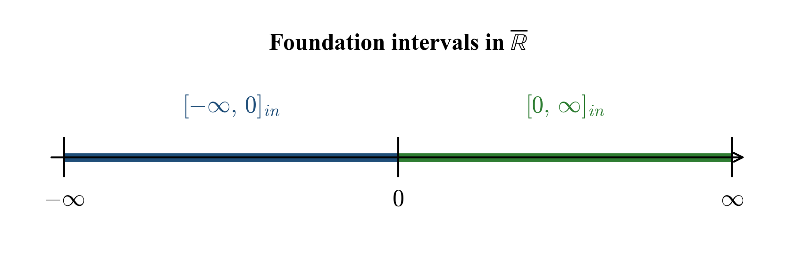
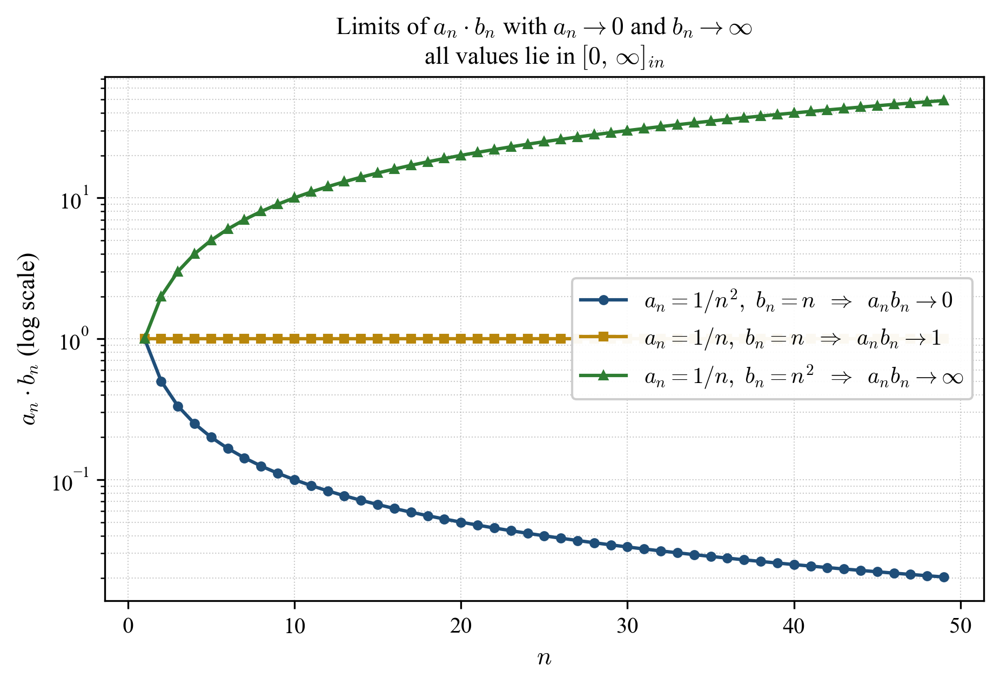

# 3. Interval Numbers: Formal Definition

[← Previous: Related Work](02_related_work.md) | [Back to Contents](../README.md) | [Next: Operations →](04_operations.md)

---

This section first fixes the arithmetic of the extended real line, then introduces interval numbers as formal mathematical objects, and finally states the foundation rules that govern indeterminate forms.

## 3.1 Preliminaries: Arithmetic in $\overline{\mathbb{R}}$

Let $\overline{\mathbb{R}} := \mathbb{R} \cup \lbrace -\infty, +\infty\rbrace$ denote the extended real line, equipped with the order extension $-\infty \le r \le +\infty$ for all $r \in \mathbb{R}$.

The standard operations on $\overline{\mathbb{R}}$ adopted in this work are summarized below.

**Defined operations.** For $r \in \mathbb{R}$ and $s \in \lbrace -\infty, +\infty\rbrace$:

| Operation | Result | Conditions |
|-----------|--------|------------|
| $r + s$ | $s$ | any $r \in \mathbb{R}$, $s \in \lbrace -\infty, +\infty\rbrace$ |
| $\infty + \infty$ | $\infty$ | |
| $(-\infty) + (-\infty)$ | $-\infty$ | |
| $r \cdot \infty$ | $\infty$ | $r > 0$ |
| $r \cdot \infty$ | $-\infty$ | $r < 0$ |
| $r \cdot (-\infty)$ | $-\infty$ | $r > 0$ |
| $r \cdot (-\infty)$ | $\infty$ | $r < 0$ |
| $\infty \cdot \infty$ | $\infty$ | |
| $\infty \cdot (-\infty)$ | $-\infty$ | |
| $r / \infty$ | $0$ | any $r \in \mathbb{R}$ |
| $r / (-\infty)$ | $0$ | any $r \in \mathbb{R}$ |

**Indeterminate forms.** The following expressions are *not* assigned a value in $\overline{\mathbb{R}}$ and are the object of study of this work:

$$0 \cdot \infty,\quad 0 \cdot (-\infty),\quad \infty + (-\infty),\quad \infty - \infty,\quad \tfrac{0}{0},\quad \tfrac{\infty}{\infty},\quad 0^{0},\quad 1^{\infty},\quad \infty^{0}.$$

In the standard treatment, computations encountering any of these forms are undefined. The interval-number framework provides a uniform algebraic interpretation.

## 3.2 Definition of an Interval Number

**Definition 3.1 (Interval Number).** Let $\overline{\mathbb{R}} = \mathbb{R} \cup \lbrace -\infty, +\infty\rbrace$ denote the extended real line equipped with the standard ordering. An **interval number** is a closed interval in $\overline{\mathbb{R}}$:

$$[x_0, x_1]_{in} := \lbrace x \in \overline{\mathbb{R}} \mid x_0 \le x \le x_1 \rbrace,$$

where $`x_0, x_1 \in \overline{\mathbb{R}}`$ and $`x_0 \le x_1`$.

**Notation.** Throughout this work, $\infty$ denotes $+\infty$; negative infinity is written explicitly as $-\infty$. Let $\mathcal{I}$ denote the set of all interval numbers.

## 3.3 Point Intervals

**Definition 3.2 (Point Interval).** A point interval is an interval number of the form $`[r, r]_{in} = \lbrace r\rbrace`$, which is identified with the element $r \in \overline{\mathbb{R}}$.

This identification provides a natural embedding $\overline{\mathbb{R}} \hookrightarrow \mathcal{I}$, $`r \mapsto [r, r]_{in}`$.

## 3.4 Foundation Rules for Indeterminate Forms

The interval-number framework assigns to each indeterminate form a closed interval in $\overline{\mathbb{R}}$. These assignments are formal algebraic conventions, motivated and supported by directional limit witnesses: in each case, the assigned interval is the convex hull of products of sequences in which the factor tending to zero is restricted to a specified sign. The two fundamental rules are:

**Rule I.** The indeterminate form $0 \cdot \infty$ is represented as

$$0 \cdot \infty = [0, \infty]_{in}.$$

**Rule II.** The indeterminate form $0 \cdot (-\infty)$ is represented as

$$0 \cdot (-\infty) = [-\infty, 0]_{in}.$$

**Directional convention.** Within Rules I and II, the symbol $0$ is interpreted as a one-sided (non-negative) approach to zero, written $0^{+}$ where emphasis is required. Concretely, Rule I represents the set of limits

$$\lbrace \, \lim_{n} a_n b_n : a_n \ge 0,\; a_n \to 0,\; b_n \to +\infty \,\rbrace,$$

and Rule II is obtained from Rule I by negation, since $`0 \cdot (-\infty) = -1 \cdot (0 \cdot \infty)`$ in the algebra of $`\mathcal{I}`$ (Section 4). Without this directional restriction, the products $`a_n b_n`$ with two-sided $`a_n \to 0`$ would attain every value in $`[-\infty, \infty]`$, and the algebraic identity that motivates the framework would collapse.

This convention is a formal choice, not a derivation; the framework should be read as an algebraic structure on $\mathcal{I}$ whose rules are *consistent with* the stated class of directional limits, rather than as a complete classification of all possible limits of all sequences fitting the symbolic form.

## 3.5 Geometric Visualization

The two foundation intervals together cover the extended real line, intersecting at the origin:

*Figure 3.1: The extended real line $`\overline{\mathbb{R}}`$ with the two foundation intervals $`[-\infty, 0]_{in}`$ (blue) and $`[0, \infty]_{in}`$ (green), corresponding to Rules II and I, respectively. The intervals are not disjoint: they share the point $`0`$.*

## 3.6 Justification for Rules I and II

The interval representations of Rules I and II are justified by exhibiting explicit *directional* sequences (with $`a_n \ge 0`$) whose products realize a representative spread of limit values within the intervals. The arguments below show that the assigned intervals are *attained*; a separate question—whether they are tight, i.e. whether every interior point is attainable as a limit—is addressed by the parametric witness below.

**For $0^{+} \cdot \infty$:**
- Sequence A: $`a_n = \tfrac{1}{n^2}`$, $`b_n = n`$. Then $`a_n b_n = \tfrac{1}{n} \to 0`$.
- Sequence B: $`a_n = \tfrac{1}{n}`$, $`b_n = n`$. Then $`a_n b_n = 1`$ for all $`n`$.
- Sequence C: $`a_n = \tfrac{1}{n}`$, $`b_n = n^2`$. Then $`a_n b_n = n \to \infty`$.

A parametric witness for any $`c \in [0, \infty)`$ is $`a_n = c/n`$, $`b_n = n`$, giving $`a_n b_n = c`$ for all $`n`$; together with Sequence C, this shows every value of $`[0, \infty]_{in}`$ is attainable as a limit.

*Figure 3.2: Three sequences $`a_n b_n`$ with $`a_n \to 0^{+}`$ and $`b_n \to \infty`$, converging to $`0`$, $`1`$, and $`\infty`$, respectively (log-scaled vertical axis). All limit values lie within $`[0, \infty]_{in}`$, consistent with Rule I.*

**For $0^{+} \cdot (-\infty)$:**
- Sequence A: $`a_n = \tfrac{1}{n}`$, $`b_n = -n`$. Then $`a_n b_n = -1`$ for all $`n`$.
- Sequence B: $`a_n = \tfrac{1}{n}`$, $`b_n = -n^2`$. Then $`a_n b_n = -n \to -\infty`$.

For any $`c \in (-\infty, 0]`$, the parametric sequences $`a_n = -c/n`$, $`b_n = -n`$ (with $`a_n \ge 0`$ since $`c \le 0`$) give $`a_n b_n = c`$ for all $`n`$, completing the witness for $`[-\infty, 0]_{in}`$.

---

[← Previous: Related Work](02_related_work.md) | [Back to Contents](../README.md) | [Next: Operations →](04_operations.md)
