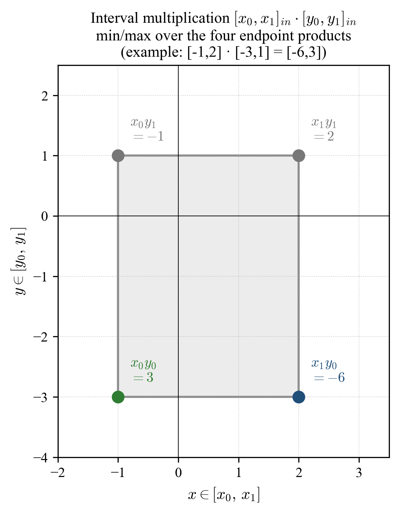
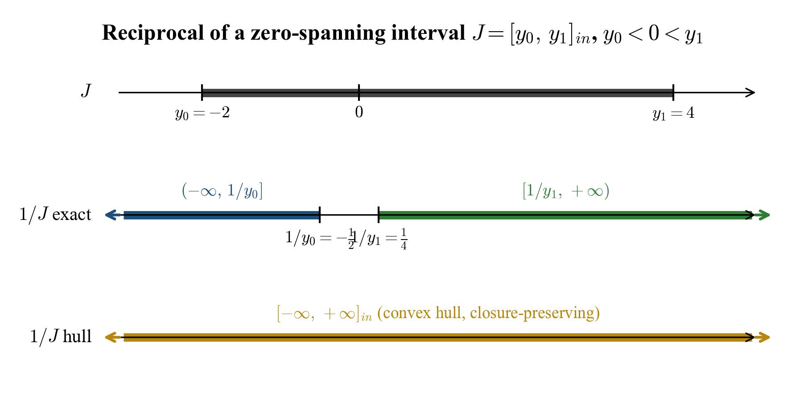

# 4. Operations on Interval Numbers

[← Previous: Interval Numbers](03_interval_numbers.md) | [Back to Contents](../README.md) | [Next: Algebraic Structure →](05_algebraic_structure.md)

---

All operations follow standard interval arithmetic [[6](08_references.md)], with explicit treatment of indeterminate forms.

## 4.1 Multiplication

**Definition 4.1 (Interval Multiplication).** For interval numbers $I = [x_0, x_1]_{in}$ and $J = [y_0, y_1]_{in}$, let $P_{ij} := x_i \cdot y_j$ for $i, j \in \{0, 1\}$. Define the **candidate set**

$$\mathcal{C}(I, J) := \bigcup_{i,j \in \{0,1\}} \mathcal{V}(x_i \cdot y_j) \;\subseteq\; \overline{\mathbb{R}},$$

where the *value map* $\mathcal{V}: \overline{\mathbb{R}} \cup \{0 \cdot \infty,\ 0 \cdot (-\infty)\} \to \mathcal{P}(\overline{\mathbb{R}})$ is defined by

$$
\mathcal{V}(p) := \begin{cases}
\{p\}, & p \in \overline{\mathbb{R}} \text{ (a defined product)}, \\
\{0, \infty\}, & p = 0 \cdot \infty \text{ (Rule I endpoints)}, \\
\{-\infty, 0\}, & p = 0 \cdot (-\infty) \text{ (Rule II endpoints)}.
\end{cases}
$$

The product is then

$$I \cdot J := [\min \mathcal{C}(I, J),\ \max \mathcal{C}(I, J)]_{in}.$$

In particular, if no $P_{ij}$ is an indeterminate form, the definition reduces to the classical interval-arithmetic formula

$$I \cdot J = [\min(x_0 y_0, x_0 y_1, x_1 y_0, x_1 y_1),\ \max(x_0 y_0, x_0 y_1, x_1 y_0, x_1 y_1)]_{in}.$$

**Scalar multiplication.** For $r \in \overline{\mathbb{R}}$ identified with the point interval $[r, r]_{in}$, Definition 4.1 specializes to:

$$
r \cdot [x_0, x_1]_{in} =
\begin{cases}
[r x_0, r x_1]_{in}, & r > 0, \\
[r x_1, r x_0]_{in}, & r < 0, \\
[0, 0]_{in}, & r = 0 \text{ and } 0 \notin\{-\infty, \infty\} \cap\{x_0, x_1\}, \\
[-\infty, 0]_{in} \text{ or } [0, \infty]_{in}, & r = 0 \text{ and } x_0 = -\infty \text{ or } x_1 = \infty \text{ (via Rules I/II)}.
\end{cases}
$$

**Geometric interpretation.** The four endpoint products correspond to the corners of the rectangle $[x_0, x_1] \times [y_0, y_1]$ in the $xy$-plane:

*Figure 4.1: Geometric view of interval multiplication. The product $[x_0, x_1]_{in} \cdot [y_0, y_1]_{in}$ is the closed interval bounded by the minimum and maximum of the four corner products. Example: $[-1, 2]_{in} \cdot [-3, 1]_{in} = [-6, 3]_{in}$.*

**Examples.**
- $(-1) \cdot [0, \infty]_{in} = [-\infty, 0]_{in}$ (validates the consistency between Rule I and Rule II).
- $2 \cdot [1, 3]_{in} = [2, 6]_{in}$.

## 4.2 Addition

**Definition 4.2 (Interval Addition).** For interval numbers $I = [x_0, x_1]_{in}$ and $J = [y_0, y_1]_{in}$, define the candidate set

$$\mathcal{C}_{+}(I, J) := \mathcal{V}_{+}(x_0 + y_0) \cup \mathcal{V}_{+}(x_1 + y_1) \;\subseteq\; \overline{\mathbb{R}},$$

where the additive value map $\mathcal{V}_{+}: \overline{\mathbb{R}} \cup \{\infty + (-\infty),\ (-\infty) + \infty\} \to \mathcal{P}(\overline{\mathbb{R}})$ is

$$
\mathcal{V}_{+}(s) := \begin{cases}
\{s\}, & s \in \overline{\mathbb{R}} \text{ (a defined sum)}, \\
\{-\infty, \infty\}, & s \in \{\infty + (-\infty),\ (-\infty) + \infty\}.
\end{cases}
$$

Then

$$I + J := [\min \mathcal{C}_{+}(I, J),\ \max \mathcal{C}_{+}(I, J)]_{in}.$$

When neither endpoint sum is indeterminate this reduces to $[x_0 + y_0,\ x_1 + y_1]_{in}$.

**Example.** $[0, \infty]_{in} + 5 = [5, \infty]_{in}$. $[0, \infty]_{in} + [-\infty, 0]_{in} = [-\infty, \infty]_{in}$.

## 4.3 Subtraction

**Definition 4.3 (Interval Subtraction).** With the analogous value map $\mathcal{V}_{-}$ that sends $\infty - \infty$ and $(-\infty) - (-\infty)$ to $\{-\infty, \infty\}$ and every defined difference to a singleton,

$$\mathcal{C}_{-}(I, J) := \mathcal{V}_{-}(x_0 - y_1) \cup \mathcal{V}_{-}(x_1 - y_0),$$

and

$$I - J := [\min \mathcal{C}_{-}(I, J),\ \max \mathcal{C}_{-}(I, J)]_{in}.$$

When no indeterminate form arises this reduces to $[x_0 - y_1,\ x_1 - y_0]_{in}$.

**Example.** $[1, 5]_{in} - [2, 3]_{in} = [-2, 3]_{in}$.

## 4.4 Reciprocal

**Definition 4.4 (Reciprocal).** Reciprocation is defined on all of $\mathcal{I}$ by the following case analysis on the divisor $J = [y_0, y_1]_{in}$:

$$
\frac{1}{J} :=
\begin{cases}
[-\infty, \infty]_{in}, & y_0 = y_1 = 0, \\
[\tfrac{1}{y_1},\ \tfrac{1}{y_0}]_{in}, & y_0 > 0 \text{ or } y_1 < 0, \\
[\tfrac{1}{y_1},\ +\infty]_{in}, & y_0 = 0,\; y_1 > 0, \\
[-\infty,\ \tfrac{1}{y_0}]_{in}, & y_0 < 0,\; y_1 = 0, \\
[-\infty, \infty]_{in}, & y_0 < 0 < y_1.
\end{cases}
$$

The conventions $1/(0^{+}) = +\infty$ and $1/(0^{-}) = -\infty$ follow from one-sided real limits; the assignment for $J = [0, 0]_{in}$ is by convention, since neither sign of approach is privileged for a point interval at zero.

When $y_0 < 0 < y_1$, the exact reciprocal is the union of two unbounded branches $[-\infty, 1/y_0]_{in} \cup [1/y_1, +\infty]_{in}$, which is not a single interval. The framework returns its convex hull $[-\infty, \infty]_{in}$, retaining closure within $\mathcal{I}$ at the cost of tightness.

*Figure 4.2: Reciprocal of a zero-spanning interval $J = [y_0, y_1]_{in}$ with $y_0 < 0 < y_1$ (example $J = [-2, 4]_{in}$). The exact reciprocal consists of two unbounded branches $(-\infty, 1/y_0]$ and $[1/y_1, +\infty)$ separated by a gap; the framework replaces this non-convex set with its convex hull $[-\infty, +\infty]_{in}$ to preserve closure within $\mathcal{I}$.*

## 4.5 Division

**Definition 4.5 (Interval Division).** Division is defined on all of $\mathcal{I} \times \mathcal{I}$ by

$$I \div J := I \cdot \frac{1}{J},$$

evaluated using [Definition 4.1](#41-multiplication) and [Definition 4.4](#44-reciprocal). The case analysis of the reciprocal makes division a total operation on $\mathcal{I}$.

**Indeterminate form $\tfrac{0}{0}$.** With $I = J = [0, 0]_{in}$, Definition 4.4 gives $1/J = [-\infty, \infty]_{in}$, and then $[0, 0]_{in} \cdot [-\infty, \infty]_{in} = [-\infty, \infty]_{in}$ via Rules I and II in Definition 4.1.

This is consistent with the one-sided limit witnesses

$$\lim_{x \to 0^{+}} \frac{x}{x^{2}} = +\infty, \qquad \lim_{x \to 0^{-}} \frac{x}{x^{2}} = -\infty,$$

and the parametric witness $a_n = c/n$, $b_n = 1/n$ giving $a_n / b_n = c$ for any $c \in \mathbb{R}$.

**Indeterminate form $\tfrac{\infty}{\infty}$.** With $I = J = [\infty, \infty]_{in}$, Definition 4.4 gives $1/J = [0, 0]_{in}$, and then $[\infty, \infty]_{in} \cdot [0, 0]_{in} = [0, \infty]_{in}$ via Rule I in Definition 4.1.

## 4.6 Absolute Value

**Definition 4.6 (Absolute Value).** Absolute value is defined by order rather than by endpoint multiplication, so that no indeterminate product is required:

$$
\lvert [x_0, x_1] \rvert_{in} :=
\begin{cases}
[x_0,\ x_1]_{in}, & 0 \le x_0, \\
[-x_1,\ -x_0]_{in}, & x_1 \le 0, \\
[0,\ \max(-x_0,\ x_1)]_{in}, & x_0 < 0 < x_1.
\end{cases}
$$

Negation of $\pm\infty$ is interpreted in $\overline{\mathbb{R}}$ in the standard way.

**Examples.** $\lvert [-5, 3] \rvert_{in} = [0, 5]_{in}$. $\lvert [-\infty, 0] \rvert_{in} = [0, \infty]_{in}$. $\lvert [0, \infty] \rvert_{in} = [0, \infty]_{in}$.

## 4.7 Exponentiation

**Definition 4.7 (Power).** Let $I = [x_0, x_1]_{in}$ and $E = [y_0, y_1]_{in}$. Exponentiation is defined as a *partial* operation on $\mathcal{I} \times \mathcal{I}$, with admissible domain

$$\mathrm{dom}(\,\cdot^{\,\cdot}) := \{(I, E) \in \mathcal{I} \times \mathcal{I} \;:\; x \ge 0 \text{ for all } x \in I,\ \text{or}\ y \in \mathbb{Z} \text{ for all } y \in E\}$$

together with the three indeterminate-form points listed below. On the admissible domain,

$$I^{E} := [\min_{i,j} V(x_i^{y_j}),\ \max_{i,j} V(x_i^{y_j})]_{in},$$

where $V$ extends each endpoint power $x_i^{y_j}$ to a finite set of values via the indeterminate-form table:

$$
V(b^{e}) := \begin{cases}
\{0, \infty\}, & b^{e} \in \{0^{0},\ 1^{\infty},\ \infty^{0}\}, \\
\{b^{e}\}, & b^{e} \in \overline{\mathbb{R}}.
\end{cases}
$$

If $(I, E) \notin \mathrm{dom}(\,\cdot^{\,\cdot})$ the operation is undefined; in the reference implementation this is signaled by NaN propagation.

**Indeterminate forms.**

$$0^{0} = 1^{\infty} = \infty^{0} = [0, \infty]_{in}.$$

**Special considerations.**
- If $I$ contains zero strictly and $E$ contains a negative value, $0^{y}$ for $y < 0$ contributes $\infty$ and the resulting interval extends to $\infty$.
- If $I$ contains a negative value strictly and $E$ contains an even integer (and only integer values), the corner products are real and the result includes $0$ when the base interval contains zero.
- If $I$ contains a negative value strictly and any value of $E$ is non-integer, the operation is partial; the implementation returns NaN.

**Justification of $0^{0} = [0, \infty]_{in}$:**
- Sequence A: $a_n = 1/n$, $b_n = 1/\sqrt{\ln n}$, then $a_n^{b_n} \to 0$.
- Sequence B: $a_n = 1/n$, $b_n = 1/\ln n$, then $a_n^{b_n} \to e^{-1}$.
- Sequence C: $a_n = 1/n$, $b_n = -1/\sqrt{\ln n}$, then $a_n^{b_n} \to \infty$.

---

[← Previous: Interval Numbers](03_interval_numbers.md) | [Back to Contents](../README.md) | [Next: Algebraic Structure →](05_algebraic_structure.md)
