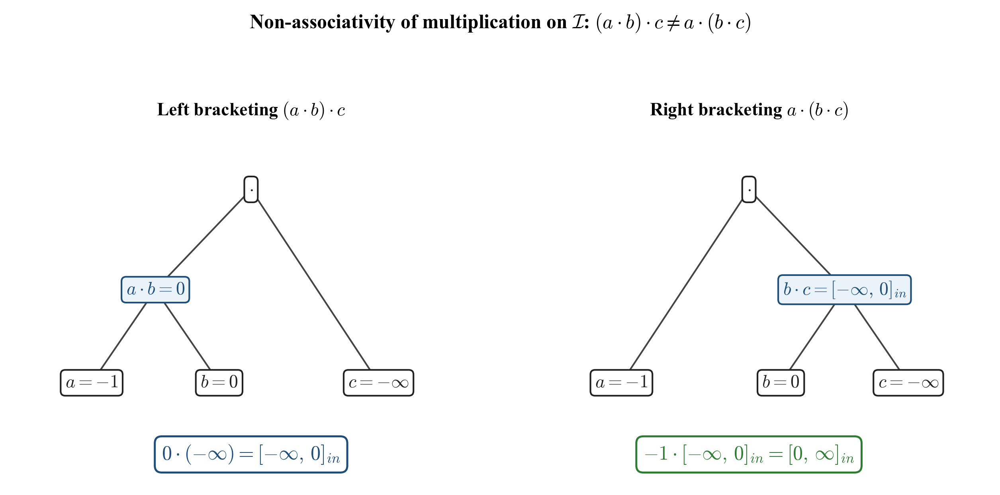
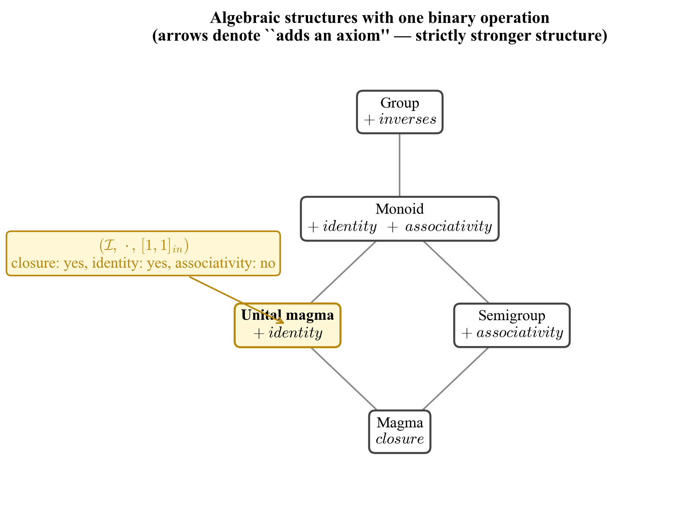

# 5. Algebraic Structure

[← Previous: Operations](04_operations.md) | [Back to Contents](../README.md) | [Next: Applications →](06_applications.md)

---

This section examines the algebraic structure induced by interval-number operations, with emphasis on which classical axioms hold and which fail.

## 5.1 Closure under Multiplication

**Theorem 5.1 (Closure).** *The set of interval numbers $\mathcal{I}$, equipped with the multiplication operation of [Definition 4.1](04_operations.md#41-multiplication), forms a* **unital magma** *[[5](08_references.md)]: it is closed under multiplication, with two-sided identity $[1, 1]_{in}$.*

**Proof of closure.** A magma is a set with a single binary operation that is closed [[4, 5](08_references.md)]. Let $`I = [x_0, x_1]_{in}`$ and $`J = [y_0, y_1]_{in}`$ be interval numbers, with $`x_0, x_1, y_0, y_1 \in \overline{\mathbb{R}}`$. Each of the four products $`P_{ij} := x_i \cdot y_j`$ for $`i, j \in \lbrace 0, 1\rbrace `$ is either:

(a) a defined element of $\overline{\mathbb{R}}$, or
(b) one of the four indeterminate forms $0 \cdot (\pm\infty)$ or $(\pm\infty) \cdot 0$, treated symmetrically by the value map $\mathcal{V}$ of [Definition 4.1](04_operations.md#41-multiplication) (Rules I and II for $0 \cdot \infty$ and $0 \cdot (-\infty)$, with the reversed forms $\infty \cdot 0$ and $(-\infty) \cdot 0$ assigned the same finite endpoint sets $\lbrace 0, \infty\rbrace $ and $\lbrace -\infty, 0\rbrace $, respectively).

In both cases the value map $`\mathcal{V}(P_{ij})`$ is a non-empty finite subset of $`\overline{\mathbb{R}}`$. Hence the candidate set $`\mathcal{C}(I, J) = \bigcup_{i,j} \mathcal{V}(P_{ij})`$ is a non-empty finite subset of $`\overline{\mathbb{R}}`$, and its minimum and maximum are well-defined. Therefore $`I \cdot J = [\min \mathcal{C},\ \max \mathcal{C}]_{in} \in \mathcal{I}`$, establishing closure.

**Proof of identity.** For $`I = [x_0, x_1]_{in}`$ with $`x_0, x_1 \in \overline{\mathbb{R}}`$, the four endpoint products in $`[1, 1]_{in} \cdot I`$ are $`1 \cdot x_0`$ and $`1 \cdot x_1`$. Since one factor is the finite nonzero scalar $`1`$, no indeterminate product of the form $`0 \cdot (\pm\infty)`$ or $`(\pm\infty) \cdot 0`$ arises, and each endpoint product is defined in $`\overline{\mathbb{R}}`$ with $`1 \cdot x_i = x_i`$. Hence $`\mathcal{C}([1,1]_{in}, I) = \lbrace x_0, x_1\rbrace `$ and $`[1, 1]_{in} \cdot I = [x_0, x_1]_{in} = I`$. The argument is symmetric in the operands. $`\blacksquare`$

## 5.2 Failure of Associativity

**Proposition 5.2 (Non-associativity).** *Multiplication on $\mathcal{I}$ is not associative.*

**Counterexample.** Let $a = -1$, $b = 0$, $c = -\infty$ (each viewed as a point interval). Then:

$$b \cdot c \;=\; 0 \cdot (-\infty) \;=\; [-\infty, 0]_{in} \quad \text{(Rule II)},$$

$$a \cdot (b \cdot c) \;=\; -1 \cdot [-\infty, 0]_{in} \;=\; [0, \infty]_{in},$$

while

$$a \cdot b \;=\; -1 \cdot 0 \;=\; 0,$$

$$(a \cdot b) \cdot c \;=\; 0 \cdot (-\infty) \;=\; [-\infty, 0]_{in} \quad \text{(Rule II)}.$$

Hence $a \cdot (b \cdot c) = [0, \infty]_{in} \ne [-\infty, 0]_{in} = (a \cdot b) \cdot c$. $\blacksquare$

*Figure 5.1: Bracketing trees for the non-associativity counterexample. With $`a = -1`$, $`b = 0`$, $`c = -\infty`$, the left bracketing $`(a \cdot b) \cdot c`$ resolves the inner product $`a \cdot b = 0`$ before applying Rule II at the outer node, yielding $`[-\infty, 0]_{in}`$; the right bracketing $`a \cdot (b \cdot c)`$ applies Rule II at the inner node and then negates, yielding $`[0, \infty]_{in}`$. The two results differ.*

This counterexample is verified in the implementation by the test `MultiplicationNotAssociative` ([`test/src/main.cpp`](../test/src/main.cpp)).

The non-associativity has a precise interpretation: the bracketing of an expression determines *when* an indeterminate form is resolved into an interval; once an interval has been formed, subsequent multiplication propagates uncertainty rather than collapsing it. The failure is therefore not inherited from real multiplication or from classical (Moore) interval multiplication, both of which are associative; it is specific to the rule by which indeterminate symbolic forms are mapped to intervals.

## 5.3 Limitations of the Structure

Beyond closure and identity, the following stronger algebraic axioms do *not* hold in general:

| Axiom | Status | Remark |
|-------|--------|--------|
| Closure | **holds** | [Theorem 5.1](#51-closure-under-multiplication) |
| Multiplicative identity | **holds globally** | $[1, 1]_{in}$ is a two-sided identity (Theorem 5.1, identity part) |
| Associativity | **fails** | [Proposition 5.2](#52-failure-of-associativity); test `MultiplicationNotAssociative` |
| Multiplicative inverses | fails | intervals containing $0$ strictly admit no inverse in $\mathcal{I}$ |
| Distributivity over $+$ | fails | sub-distributivity holds in classical interval arithmetic [[6](08_references.md)]; full distributivity does not transfer to $\mathcal{I}$ |

The structure $(\mathcal{I}, \cdot, [1,1]_{in})$ is therefore a **unital magma**: closure and a two-sided identity hold, but associativity fails so it is neither a semigroup nor a monoid. Identifying maximal sub-structures on which stronger axioms recover (e.g., associativity on point-interval subsemigroups, monoidal behaviour on intervals bounded away from zero) is left to future work; see [Section 7](07_conclusion.md).

*Figure 5.2: Position of $(\mathcal{I}, \cdot, [1,1]_{in})$ in the standard hierarchy of algebraic structures with a single binary operation. Each upward edge denotes the addition of an axiom (associativity, identity, or inverses). The structure satisfies closure and identity but not associativity, locating it at **unital magma**; it does not lift to a monoid because of the counterexample of [Proposition 5.2](#52-failure-of-associativity).*

## 5.4 Significance

Despite the limitations of [Section 5.3](#53-limitations-of-the-structure), the unital-magma structure is sufficient to support consistent algebraic manipulation of indeterminate forms within bracketed expressions, as demonstrated in [Section 6](06_applications.md). Crucially, the framework makes the failure of associativity *visible and meaningful* rather than hiding it behind an undefined symbol: bracketing now corresponds to a specific algebraic choice with computable consequences.

---

[← Previous: Operations](04_operations.md) | [Back to Contents](../README.md) | [Next: Applications →](06_applications.md)
